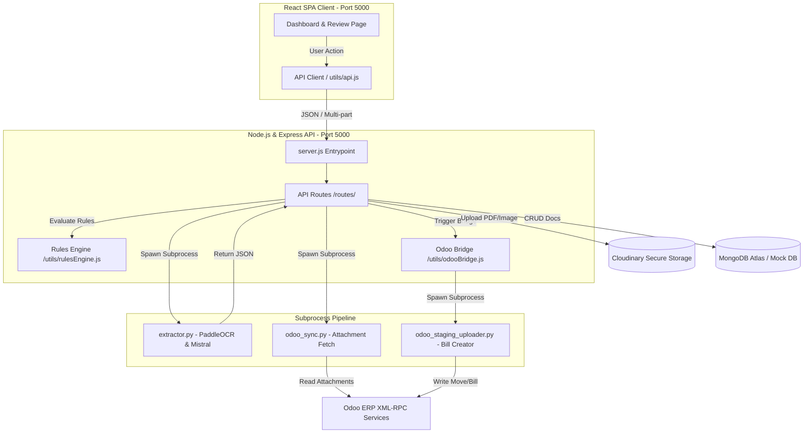
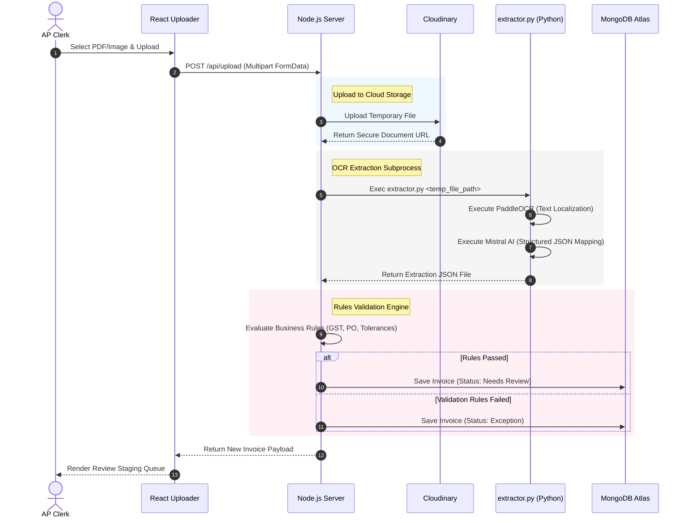

# AP Automation Platform Architecture

This document describes the system components, data pipelines, validation rules engine, and ERP integrations of the Accounts Payable (AP) Automation MERN stack web application.

---

## 1. High-Level Architecture

The platform follows a split-tier architecture consisting of a **React Single Page Application (SPA) Frontend**, a **Node.js/Express API Backend**, a **Python OCR/AI Extraction Pipeline**, and an integration bridge to **Odoo ERP**.

---

## 2. Detailed Data Flow Pipelines

### 2.1 Invoice Upload & OCR Extraction Pipeline
When a user uploads a new invoice, the system processes it through a secure multi-stage workflow:

---

## 3. Detailed Component Breakdown

### 3.1 React SPA Frontend (`/frontend`)
*   **Routing Layout (`App.jsx`)**: Implements sidebar dashboard navigation, a Developer Role Swapper (switchboard simulating role permissions), and globally accessible system notifications.
*   **Staging Queue (`StagingQueue.jsx`)**: The operations deck. Shows a paginated directory of invoices, allows keyword searches, filter statuses, and batch approvals/posting.
*   **Invoice Review (`InvoiceReview.jsx`)**: Side-by-side zoomable layout. Shows the Cloudinary-hosted document (PDF/Image) on the left pane and metadata edits, items breakdown table, and rules error logs on the right.
*   **Exception Queue (`ExceptionQueue.jsx`)**: Tracks invoices currently locked due to variance issues. Allows Finance Managers or Admins to bypass rule failures using the **Override** action.
*   **API Interface Client (`utils/api.js`)**: Automatically includes auth credentials and intercepts communication failures. If the Node.js API server drops offline, it falls back to a mock local state manager (`mockFallback`) to enable disconnected frontend simulation.

### 3.2 Node.js & Express API Backend (`/backend`)
*   **Database Seeder (`config/dbSeeder.js`)**: Automatically seeds initial rules, mock POs, and audit logs into MongoDB Atlas if the collections are empty.
*   **Rules Engine (`utils/rulesEngine.js`)**: Validates documents against 4 business rules:
    *   *Duplicate Detection*: Flags similar vendor invoices (matching invoice numbers or matching total + date combinations).
    *   *GST Validation*: Validates state and pan check digit layout using standard 15-character regex checks.
    *   *PO Matching & Price Tolerances*: Computes 2-way and 3-way matches (validates items descriptions, quantities, and price differences against a 5% tolerance limit).
    *   *Amount Threshold Routing*: Routes payments exceeding ₹5,000/$5,000 for multi-manager review.
*   **Audit Logger (`/routes/audits.js`)**: Appends records into the `AuditTrail` collection for every system event (uploads, Odoo syncs, exceptions overrides, database edits) to track user/role accountability.

### 3.3 Python Integration Bridge (`/backend/utils`)
*   **Odoo Synchronizer (`odoo_sync.py`)**: Connects to the ERP via XML-RPC. Fetches raw attachments, syncs invoice lines, decodes base64 document files, and feeds them into the MERN backend.
*   **ERP Posting Bridge (`odoo_staging_uploader.py`)**: When an invoice is approved and posted, the Node.js server executes this python script. It parses validation tokens and generates a formal `account.move` vendor bill in Odoo, completing the pipeline.
